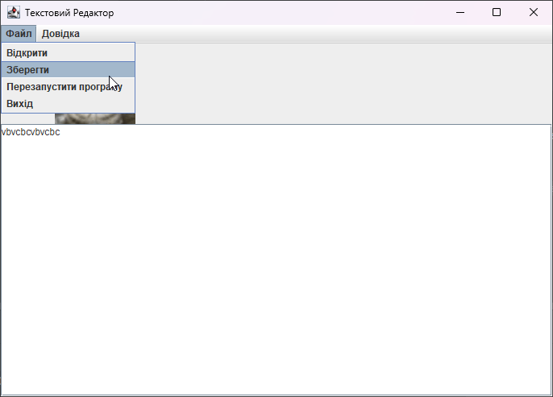
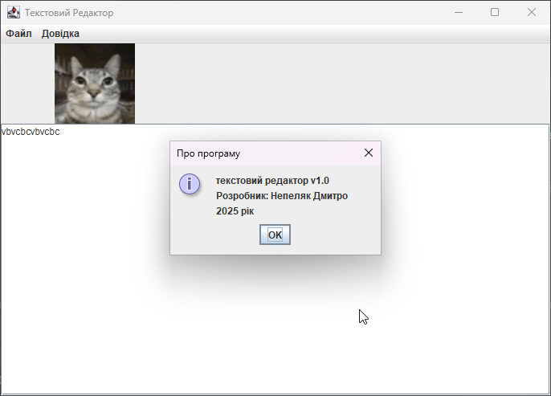
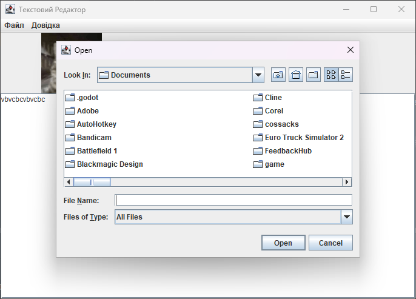
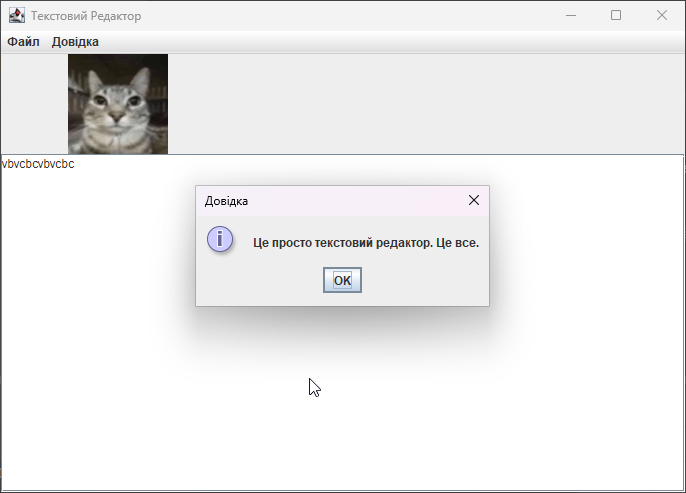

### Лабораторна робота №7. Створення програм з графічним інтерфейсом користувача.

# Завдання:
У наступних завданнях виконати малюнок у площині деякої області вікна програми або кадру. Якщо в варіанті завдання робота з графічними примітивами не передбачена (калькулятор, конвертер валюти, тощо), вставити зображення, які б давали змогу користувачу краще розуміти суть виконуваних ним дій або приносили естетичне задоволення. Загальне вікно програми, крім базового функціоналу, має містити меню з елементами: Файл Перезапустити програму, Вихід, Довідка Довідка по <ім’я програми> Про програму   
  18. Реалізувати простий текстовий редактор (з меню Файл (відкрити/зберегти/вийти) і полем редагування тексту) 

# Кілька скріншотів із редактора:

